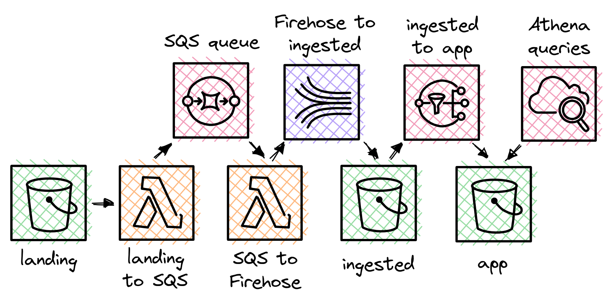

# AWS Serverless Challenge



As default values, all the buckets in this project has the suffix "2152" to make then unique in the project. Also, a `./env/credentials.env` file with the aws credentials is expected as default. You can change it in the Makefile by changing the docker commands to provide your credentials in the way you want. First, create the backend bucket where terraform will store and update the infrastructure state:

```shell
aws s3 mb s3://tfbackend-2152
```

Then, initiate the terraform backend with:

```shell
make init TF_PATH="path/to/my/tf/files"
```

To apply the changes in the tf files, run the following:

```shell
make apply TF_PATH="path/to/my/tf/files"
```

# Docker images from Lambda functions

First, build your Docker image with the python source code:

```shell
docker build functions --tag functions
```

So, sign in into AWS with ECR and docker:

```shell
aws ecr get-login-password --region sa-east-1 \
| docker login --username AWS --password-stdin 343221145296.dkr.ecr.sa-east-1.amazonaws.com
```

Then, tag your image and push your it into the ECR repository:

```shell
docker tag functions:latest 343221145296.dkr.ecr.sa-east-1.amazonaws.com/functions-2152:latest \
    && docker push 343221145296.dkr.ecr.sa-east-1.amazonaws.com/functions-2152:latest
```

As a wrapper to this commands, you can just run:

```shell
make lambda-release FUNCTION="your-function-name"
```
